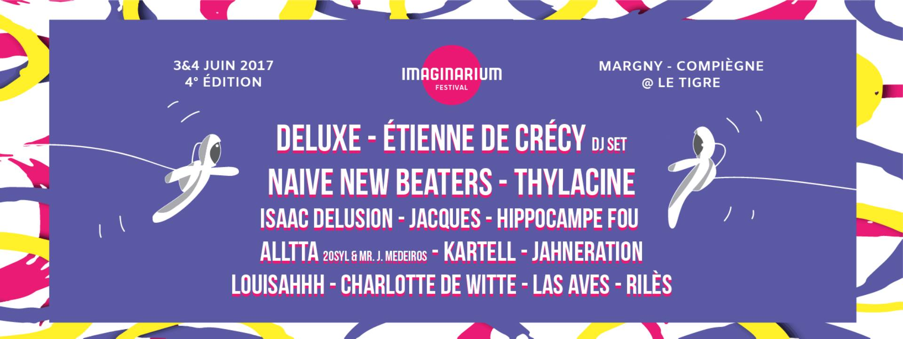

# IF17

Toutes les informations importantes sur l’édition 2017 de l’Imaginarium Festival festival à portée de pouce !

Découvre ou redécouvre la programmation de la 4ème édition grâce aux biographies et à la radio des artistes qui te feront vibrer les 3 et 4 juins prochains !

Ne perds plus de temps à faire la queue ! Recharge ton compte cashless Cosmo’Pay en un claquement de doigt !

Sois toujours au fait des dernières news, grâce au Social Wall
Mais aussi :
-informations pratiques
-camping
-carte interactive pour t’y retrouver
-timetable pour ne louper aucun concert !

## Installation

L'application est présente sur l'[App Store](https://itunes.apple.com/fr/app/if/id1105138680?mt=8) et le [Play Store](https://play.google.com/store/apps/details?id=com.imaginariumfestival.ifapp) en téléchargement gratuit.

## Cadre de développement

Le développement de l'application a été réalisé en [React Native](https://facebook.github.io/react-native/) sous la version `O.39`. Ce choix de développement par un outils de cross-plateform se justifie par le manque de temps et de moyen pour réaliser deux applications distinctes dans les languages natifs (Objective-C et Java).

Le développemet a été réalisé à partir de zéro et nous nourrissons encore de nombreuses idées d'amélioration pour l'avenir en espérant être encore porteur du projet pour l'année 2018.

> Stay tune

# Une histoire 

* Octobre 2016 
	* Récupération du projet de développement de l'application
* Octobre 2016 - Janvier 2017 
	* Découverte de React-Native
* Janvier 2017 - Avril 2017
	* Réception du cahier des charges et début du projet Git
	* Développement 
* Avril 2017 
	* Test de l'application à grande échelle
	* Retours 
* Avril 2017 - Mai 2017
	* Corrections des bugs et améliorations
* Mai 2017 
	* Publications de l'application sur les stores iOS et Android

> En parallèle de ces dates clés avait lieu chaque semaine une réunion avec l'équipe de communication de l'Imaginarium Festival où était discuté l'avancement du projet.

## Crédits

Application mobile, développée par l'Imaginarium Festival, Association, loi 1901, domiciliée à l'adresse : UTC - Maison des Etudiants, Rue Roger Couttolenc, 60200 Compiègne, France.

### Développeurs

**Matthieu Petit** Etudiant en Génie Informatique à l'UTC - [Linkedin](https://www.linkedin.com/in/petitmat/)

**Pierre-Louis Lacorte** Etudiant en Génie Informatique à l'UTC - [Linkedin](https://www.linkedin.com/in/pierre-louis-lacorte/)

### Porteur du Projet

**Ulysse Ferreira** : Responsable Communication IF17

### Autres soutiens

**Mileno Guillorel-Obregón** : Directeur Artistique
**Pierrick Simon** : Graphiste
**Georges Graire** : Graphiste  
**Guillaume Cohen** : Graphiste 
**Jo Colina** : Bot Messenger

## Plugins React-Native utilisés

* react-native-router-flux
* react-native-cacheable-image
* react-native-parallax-scroll-view
* react-native-animatable 
* react-native-maps 

> **react-native-maps** n'est pas utilisé sous Android car nous utilisons une version trop ancienne de React-Native et Google Map n'est plus accessible.

